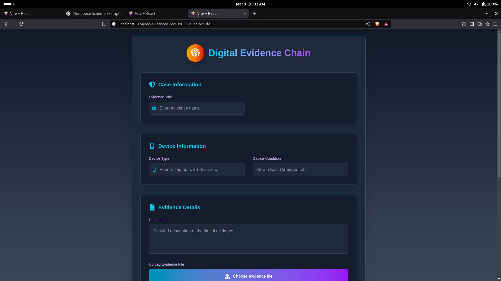
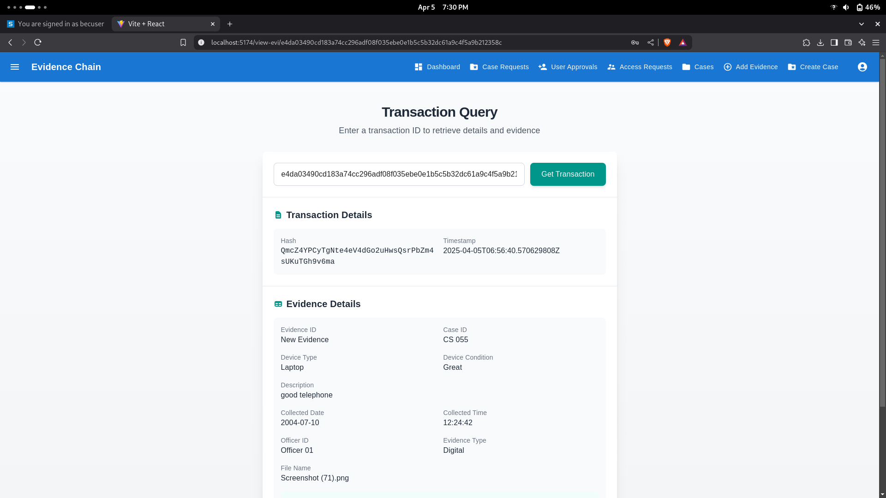

# 🔐 Blockchain-Based Digital Evidence Collection System

> A decentralized and tamper-proof digital evidence management system built using Hyperledger Fabric and IPFS, with a React frontend, Express.js backend, and MongoDB for metadata storage.

---

## 📌 Table of Contents

- [🌟 Features](#-features)
- [⚙️ Tech Stack](#️-tech-stack)
- [📁 Project Structure](#-project-structure)
- [🚀 Getting Started](#-getting-started)
- [🔧 Setup Instructions](#-setup-instructions)
- [📸 Screenshots](#-screenshots)
- [📜 License](#-license)

---

## 🌟 Features

- 🔗 **Immutable Evidence Storage** using Hyperledger Fabric
- 🧊 **Decentralized File Storage** with IPFS (Kubo)
- 🧑‍💼 Role-based user access (Admin, Officer, Verifier)
- 🌐 **Modern React Frontend** with clean UI/UX
- ⚙️ REST API with Express.js for communication
- 🗂️ Metadata storage using MongoDB
- 🛡️ Tamper-proof audit trail for all uploaded evidence
- 📡 Blockchain-based verification and chain of custody

---

## ⚙️ Tech Stack

| Layer           | Technology                        |
|----------------|------------------------------------|
| 🔗 Blockchain   | Hyperledger Fabric (v2.5+)         |
| 📁 File Storage | IPFS (Kubo daemon)                |
| 🌐 Frontend     | React, Tailwind CSS               |
| 🔌 Backend      | Node.js, Express.js               |
| 🛢️ Database     | MongoDB (Mongoose ORM)            |
| 🔒 Auth         | JWT-based Authentication          |
| 🧪 DevOps       | Docker, Docker Compose            |

---

## 📁 Project Structure

```
evidence-system/
│
├── client/             # React frontend
├── server/             # Express backend
│   ├── controllers/
│   ├── models/
│   ├── routes/
│   └── config/
├── blockchain/         # Hyperledger Fabric chaincode & network config
│   └── chaincode/
├── ipfs/               # IPFS integration scripts
├── .env
├── docker-compose.yml
└── README.md
```

---

## 🚀 Getting Started

### 1️⃣ Prerequisites

- Docker & Docker Compose
- Node.js and npm
- IPFS (Kubo)
- Hyperledger Fabric binaries and images
- MongoDB (local or MongoDB Atlas)

---

## 🔧 Setup Instructions

### 1. Clone the Repository

```bash
git clone https://github.com/your-username/evidence-system.git
cd evidence-system
```

### 2. Spin up IPFS Daemon

```bash
ipfs init
ipfs daemon
```

### 3. Start Hyperledger Fabric Network

```bash
cd blockchain
./network.sh up createChannel -ca
./network.sh deployCC -ccn evidencemanager -ccp ../chaincode/ -ccl javascript
```

### 4. Install Dependencies

```bash
# Backend
cd server
npm install

# Frontend
cd ../client
npm install
```

### 5. Configure Environment Variables

Create `.env` files in both `server/` and `client/` directories.

Example `.env` for server:

```env
PORT=5000
MONGO_URI=mongodb://localhost:27017/evidenceDB
JWT_SECRET=your_jwt_secret_key
IPFS_API_URL=http://localhost:5001
```

### 6. Run the Application

```bash
# Backend
cd server
npm start

# Frontend
cd ../client
npm run dev
```

---

## 📸 Screenshots

| Upload Evidence | View History & Verify |
|-----------------|------------------------|
|  |  |

---

## 📜 License

This project is licensed under the **MIT License**.

---

## 🤝 Contributing

Pull requests are welcome! For major changes, please open an issue first to discuss what you would like to change.

---

## 💬 Connect

- 🔗 [LinkedIn](https://linkedin.com/in/prajwalshettar43)
- 🐙 [GitHub](https://github.com/prajwalshettar43)

---

> Built with ❤️ using Hyperledger Fabric, IPFS, React, Express, and MongoDB.

